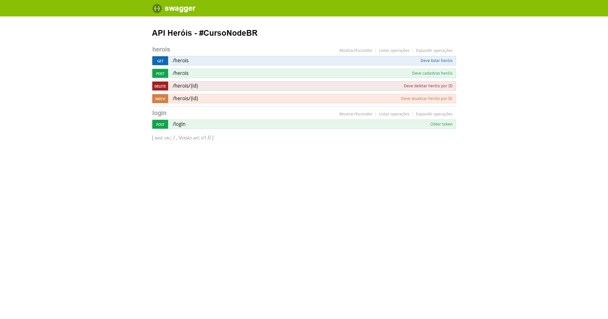
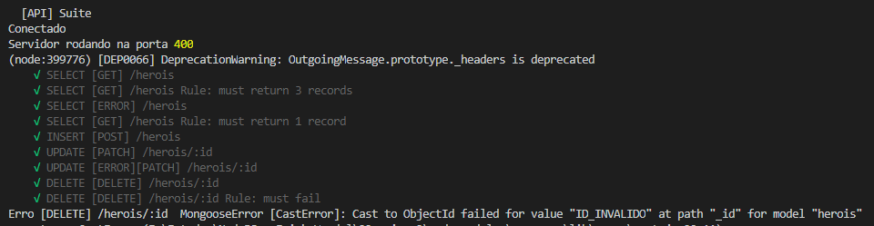
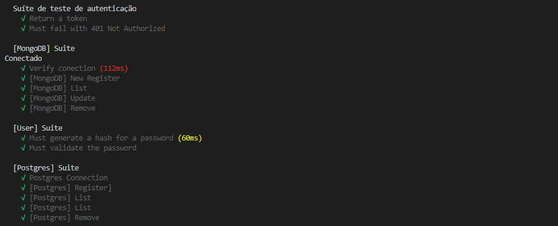

<h1 align="center">
     [API] Heroes 
    Node.js | Hapi | Mocha 
    <a target="_blank" href="https://cursonodebr-fb.herokuapp.com/documentation">
        Live example
    </a>
</h1>

## Featured Images

     
     
     

## Technologies
<ul>
    <li>
        <a target="_blank" href="https://nodejs.org/en/">Node.js</a>
    </li>
    <li>
        <a target="_blank" href="https://mochajs.org/">Mocha</a>
    </li>
    <li>
        <a target="_blank" href="https://joi.dev/">JOI</a>
    </li>
    <li>
        <a target="_blank" href="https://hapi.dev/">Hapi</a>
    </li>
    <li>
        <a target="_blank" href="https://swagger.io/">Swagger</a>
    </li>
    <li>
        <a target="_blank" href="https://www.npmjs.com/package/bcrypt/">Bcrypt</a>
    </li>
    <li>
        <a target="_blank" href="https://jwt.io/">JTW</a>
    </li>
    <li>
        <a target="_blank" href="https://www.docker.com/">Docker</a>
    </li>
    <li>
        <a target="_blank" href="https://www.mongodb.com/">MongoDB</a>
    </li>
    <li>
        <a target="_blank" href="https://www.postgresql.org/">Postgres</a>
    </li>
</ul>

---
Project developed in [Erick Wendel](https://erickwendel.com.br/) classes.